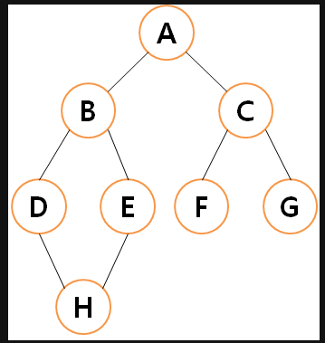

[참고가이드](https://megaptera.notion.site/6-5f9b4105eb0748fd8f8baa631d92d6ea)

### 1. 이해
- 숫자 배열과 목표 숫자가 주어진다.
- 숫자 배열에 들어있는 수들을 적절히 조합해서 목표 숫자를 만들 수 있는 방법의 수를 리턴한다.
- 그래프 탐색 : 하나의 정점으로부터 시작해서 차례대로 모든 정점들을 한번씩 방문해야한다.
- DFS -> 깊이 우선 탐색 : 해당 분기를 완벽하게 탐색하고 넘어가는 방법 : 재귀 또는 스택으로 구현한다. == 백트래킹 (방문한 노드는 확실하게 확인해줘야 한다.)
- BFS -> 너비 우선 탐색 : 인접한 노드부터 방문하는 방법 : 큐를 이용해서 구현한다. == 최단거리 문제

- 그래프 탐색 : 그래프에 그려진 모든 경우의 수를 방문해야 한다.
### 2. 계획
- 
[1,2,3,4,5], 3

1 -> +1 or -1
2 -> +2 or -2
3 -> +3 or -3
4 -> +4 or -4
5 -> +5 or -5
- 그래프를 탐색해야한다.
- 노드와 간선을 먼저 파악해야한다.

- 시간 복잡도 계산하기
- 경우의수가 500만번 이하인지 체크
- 나올 수 있는 경우의수를 체크하자. 

- DFS 재귀를 활용할 때 Solution -> 수행동작을 먼저 고려해야한다.
- 여기서 수행동작 : 각각의 숫자에 더할지와 뺄지를 정해주면된다.

### 3. 실행
- 

### 4. 반성
- DFS를 생각할 때는 하나의 경우의수를 쭉 따라간다고 생각해보자.
- 자바에서도 재귀를 적극사용해보자. 
