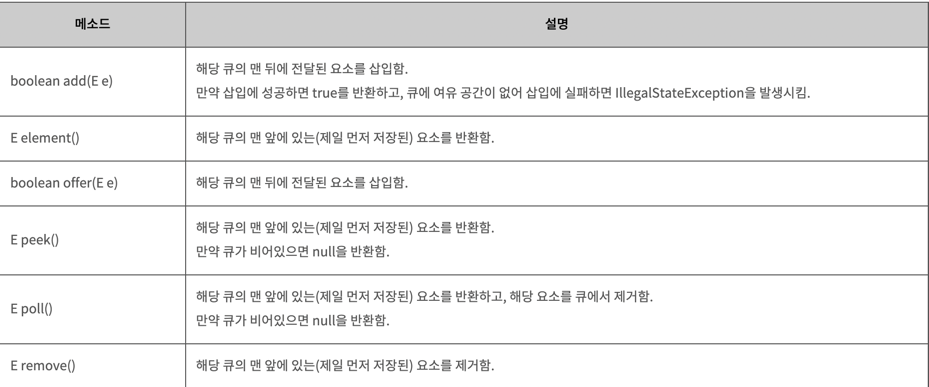

[참고가이드](https://megaptera.notion.site/6-5f9b4105eb0748fd8f8baa631d92d6ea)

### 1. 이해
- 현재 순서보다 우선순위가 높은 값이 존재하면 맨뒤로 보낸다.
- 주어진 것: 우선순위 배열, 내가 요청한 문서의 인덱스
- 구해야 하는 것: 몇번째로 내 문서가 출력되는지

### 2. 계획
- 가장 최근 문서와 문서 전체의 우선순위를 비교하는 함수
- 가장 최근 문서를 맨뒤로 보내는 함수
- 내 문서의 순서를 구하는 함수 -> 내 문서의 우선순위가 최우선이 될때까지 루프를 돌리기

### 3. 실행
- 

### 4. 반성
- 객체지향적으로 풀어보려 했음 -> 좋은 시도
- 하지만 하나의 메서드에서 두개 이상의 상태를 변경하려는 일이 자주 생겼다. 
- -> 단일 책임 원칙을 위배하는 것 같다는 생각이 많이 들었다.
- 하나의 관심사라는 말의 기준은 무엇일까? 하나의 상태가 하나의 관심사인가?
- Printer보다는 하나하나의 물건을 도메인 모델로 빼는게 좋았을 것 같다. -> 아이템 각각의 순서와 우선순위를 가지고 있으니깐

Queue의 메소드
- boolean add(E e)
  해당 큐의 맨 뒤에 전달된 요소를 삽입함.
  만약 삽입에 성공하면 true를 반환하고, 큐에 여유 공간이 없어 삽입에 실패하면 IllegalStateException을 발생시킴.

- E element()	해당 큐의 맨 앞에 있는(제일 먼저 저장된) 요소를 반환함.

- boolean offer(E e)	해당 큐의 맨 뒤에 전달된 요소를 삽입함.

- E peek()
해당 큐의 맨 앞에 있는(제일 먼저 저장된) 요소를 반환함.
만약 큐가 비어있으면 null을 반환함.

- E poll()
해당 큐의 맨 앞에 있는(제일 먼저 저장된) 요소를 반환하고, 해당 요소를 큐에서 제거함.
만약 큐가 비어있으면 null을 반환함.

- E remove()	해당 큐의 맨 앞에 있는(제일 먼저 저장된) 요소를 제거함.
