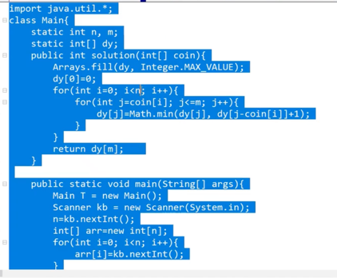

[참고가이드](https://megaptera.notion.site/6-5f9b4105eb0748fd8f8baa631d92d6ea)

### 1. 이해
- DP: 동적 프로그래밍
- 거대한 문제를 작게 쪼개서 저장해놓고 다음에 활용하는 방법이다.
- 20이라는 문제가 있으면 1 또는 2로 쪼개놓고 이걸 디딤돌 삼아서 만드는 것.

계단 오르기
- 철수는 한번에 계단 한 칸 또는 두 칸만 올라갈 수 있다.
- n개의 계단이 있을 때 철수가 올라갈 수 있는 경우의 수는?
-> 1, 2칸을 올라가는 것으로 문제를 쪼갠다.
- 3칸을 올라갈 수 있는 방법 1번째 계단으로 올라갈 수 있는 경우 + 2번째 계단으로 올라갈 수 있는 경우의 수

돌다리 건너기
- 철수가 n개의 돌다리를 건넌다.
- 한번에 1개 또는 2개의 돌다리를 건널 수 있다.
- 건널 수 있는 방법의 경우의 수

동전교환 (냅색 알고리즘)
-  

### 2. 계획
- 

### 3. 실행
- 

### 4. 반성
-
