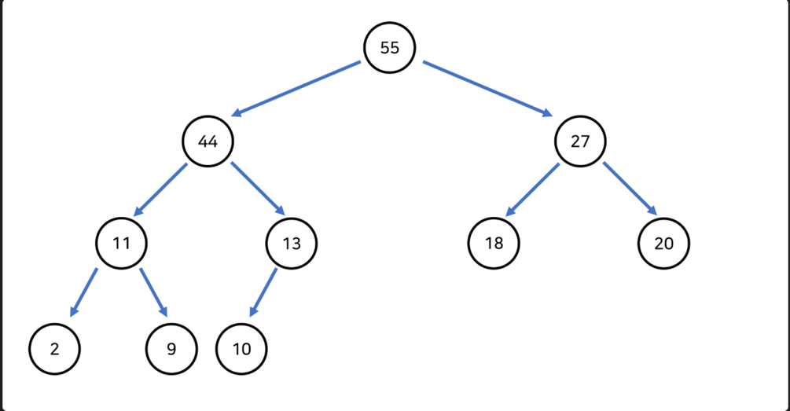
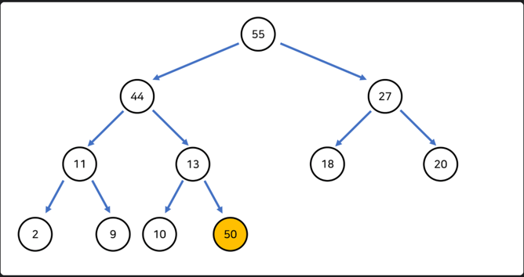

[참고가이드](https://megaptera.notion.site/6-5f9b4105eb0748fd8f8baa631d92d6ea)

### 1. 이해
섞은 음식의 스코빌 지수 = 가장 맵지 않은 음식의 스코빌 지수 + (두 번째로 맵지 않은 음식의 스코빌 지수 * 2)

Leo는 모든 음식의 스코빌 지수가 K 이상이 될 때까지 반복하여 섞습니다.
Leo가 가진 음식의 스코빌 지수를 담은 배열 scoville과 원하는 스코빌 지수 K가 주어질 때, 
모든 음식의 스코빌 지수를 K 이상으로 만들기 위해 섞어야 하는 최소 횟수를 return 하도록 solution 함수를 작성해주세요.

scoville의 길이는 2 이상 1,000,000 이하입니다.
K는 0 이상 1,000,000,000 이하입니다.
scoville의 원소는 각각 0 이상 1,000,000 이하입니다.
모든 음식의 스코빌 지수를 K 이상으로 만들 수 없는 경우에는 -1을 return 합니다.

힙이란?
영단어 힙(heap)은 '무엇인가를 차곡차곡 쌓아올린 더미'라는 뜻을 지니고 있다. 
부모 노드가 가진 값은 자식 노드의 값보다 무조건 크거나(Max Heap) 작아야(Min Heap) 한다. 
또한 완전 이진 트리이므로 위에서 설명한 구조적 특징으로 배열을 통해 구현가능 하다.

부모 노드의 값이 무조건 자식 노드의 값보다 큰 힙을 Max Heap, 작은 힙을 Min Heap이라고 하는데, 
설명의 편의를 위해 MaxHeap을 기준으로 설명해보도록 하겠다.

위의 그림이 MaxHeap의 모습이다. 보면 알겠지만 들어가있는 데이터중 Root의 값이 가장 크다. 또한 모든 서브트리에 대해서도 같다. 
이러한 성질을 이용해서, 가장 크거나 작은 값을 찾아내는 연산을 빠르게 하기위해 고안된 자료구조라고 할 수 있다. 
가장 큰 값을 구하고자 할때 Root의 값을 가져오면 되므로 O(1)의 시간복잡도를 가진다.

자료 추가
그러면 이 힙에 자료를 추가하려면 어떻게 해야할까?

1. 새로운 노드를 트리의 맨 뒤에 추가한다. (완전 이진 트리의 형태를 깨면 안됨)
2. 추가된 노드와 부모 노드를 비교하여 자식 노드가 크다면 서로의 위치를 바꾼다.
3. 2번 작업을 부모 노드가 더 클때까지 반복한다.

이러한 작업을 통해여 자료를 추가할 수 있다. 글로만 보면 이해하기 힘들 수 있으니 그림을 통해 알아보자.

마지막 노드에 자료 추가 -> 부모 노드와 비교 -> 더 크다면 스왑 -> 부모노드와 비교 -> 더 크다면 스왑 ... -> 루트 노드와 비교 -> 더 크다면 스왑

자료 삭제
최소값은 삭제해도 힙에 아무 영향이 없고, 최댓값인 루트 노드를 삭제할 때만 구조의 변경이 발생

루트 삭제 -> 마지막 노드 루트로 이동 -> 자식 노드와 비교 -> 작으면 내리기 -> 자식노드와 비교 ... -> 마지막 노드로 이동

힙의 특징 : 부모간에는 대소 관계가 확실하다. 하지만 형제간에는 모른다. -> 최소힙을 쓸 지 최대 힙을 쓸지 잘 정해라.

힙의 구현
[특징]
1. 구현의 용이함을 위해 시작 인덱스(root)는 1 부터 시작한다.
2. 각 노드와 대응되는 배열의 인덱스는 '불변한다'

위 특징을 기준으로 각 인덱스별로 채워넣으면 특이한 성질이 나오는데 이는 다음과 같다.

[성질]
1. 왼쪽 자식 노드 인덱스 = 부모 노드 인덱스 × 2
2. 오른쪽 자식 노드 인덱스 = 부모 노드 인덱스 × 2 + 1
3. 부모 노드 인덱스 = 자식 노드 인덱스 / 2

위 세개의 법칙은 절대 변하지 않는다.

예로들어 index 3 의 왼쪽 자식 노드를 찾고 싶다면 3 × 2를 해주면 된다. 즉 index 6 이 index 3 의 자식 노드라는 것이다.

반대로 index 5의 부모 노드를 찾고 싶다면 5 / 2 를 해주면 된다.(몫만 취함) 그러면 2 이므로 index 2가 index 5의 부모노드라는 것이다.

자바에서는 PriorityQueue가 최소힙을 구현한다.

최대힙은 PriorityQueue의 생성자로 compare를 오버라이드 한 새로운 Comparator를 전달해주면 된다.
@Override
public int compare (o1, o2) -> - Integer.compare(o1, o2)

### 2. 계획
- 최소 힙을 사용한다.
- 루트값의 스코빌 지수가 k를 넘는지 확인한다.
- 안넘으면 루트와 부모중 작은 값을 이용하여 스코빌 지수를 새로 계산한다.
- 스코빌 지수가 k를 넘으면 계산횟수 리턴, 배열의 길이가 1이 되면 -> -1리턴

### 3. 실행
- 

### 4. 반성
- 일급 컬렉션을 쓰니 굉장히 테스트하기 좋고, 원하는 로직을 짜기 편했다. 적극적으로 사용하자.
- 힙이라는 새로운 자료구조를 알게 되었다. 트리구조는 O(logN)의 시간 복잡도를 가지고 있으니, 큰 규모의 수에서는 힙을 적극 사용하자.
